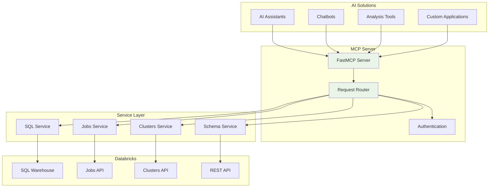

# Bricks and Context

**A Model Context Protocol (MCP) server that enables AI solutions to seamlessly communicate with Databricks**

## Overview

Bricks and Context is a comprehensive MCP server that provides AI applications with native access to Databricks functionality. It enables AI assistants, chatbots, and other AI-powered tools to execute SQL queries, manage Databricks jobs, control clusters, and access real-time data insights directly from Databricks workspaces.

### Key Features

- **🔍 SQL Query Execution** - ✅ Run complex SQL queries against Databricks SQL warehouses
- **📊 Schema Discovery** - ✅ Explore database schemas and table structures
- **🔐 Secure Authentication** - ✅ Environment-based credential management
- **🚀 Real-time Integration** - ✅ Direct API integration with Databricks SQL APIs
- **📋 Job Management** - 🔄 List, monitor, and manage Databricks job workflows (Coming Soon)
- **⚙️ Cluster Operations** - 🔄 Control and monitor Databricks cluster lifecycle (Coming Soon)

## 🎯 Current Status

**✅ Phase 1 Complete - Production Ready!**

The MCP server core is fully implemented and tested with essential tools for AI integration:

- **Connection Pool** - Thread-safe pooling optimized for AI request patterns
- **MCP Server Core** - FastMCP-based server with 6 essential tools
- **Comprehensive Testing** - Unit tests (100% pass) and integration tests with real Databricks
- **Production Ready** - Error handling, logging, and environment configuration

**Available MCP Tools:**
- `execute_sql_query` - Execute SQL queries with AI-optimized markdown output
- `discover_schemas` - Discover available databases and schemas
- `discover_tables` - List tables in schemas with metadata
- `describe_table` - Get detailed table schema information
- `get_table_sample` - Sample table data for AI analysis
- `connection_health` - Monitor connection pool health

**Integration Tested:**
- ✅ Real Databricks connection (160 schemas discovered)
- ✅ All tools tested and working
- ✅ AI-optimized markdown table output
- ✅ Thread-safe concurrent requests
- ✅ Ready for Claude Desktop integration

## Architecture



## Quick Start

### Prerequisites

- Python 3.11+
- Databricks workspace access
- Databricks SQL warehouse configured
- Personal access token or service principal credentials

### Installation

1. **Clone the repository**
   ```bash
   git clone https://github.com/your-org/bricks-and-context.git
   cd bricks-and-context
   ```

2. **Install dependencies**
   ```bash
   # Using uv (recommended - modern Python package manager)
   uv sync --dev
   
   # Or using pip
   pip install -e ".[dev]"
   ```

3. **Configure environment**
   ```bash
   # Recommended:
   cp auth.template.yaml auth.yaml   # NOT committed (contains secrets)
   # config.json is committed project properties; tweak as needed

   # Optional: env-based setup is still supported via environment variables
   ```

### `auth.yaml` format (do not commit)

Create `auth.yaml` in the repo root:

```yaml
default_workspace: dev

workspaces:
  - name: dev
    host: your-dev.cloud.databricks.com
    token: dapi...
    http_path: /sql/1.0/warehouses/....

  - name: prod
    host: your-prod.cloud.databricks.com
    token: dapi...
    http_path: /sql/1.0/warehouses/....
```

4. **Test the connection** (optional)
   ```bash
   python local/testing/test_mcp_integration.py
   ```

5. **Run the MCP server**
   ```bash
   python run_mcp_server.py
   ```

## Cursor Setup (MCP)

This server runs over **stdio**, which is the format Cursor expects for MCP servers.

- **Command**: run the server via `python run_mcp_server.py` (or `uv run python run_mcp_server.py` if you prefer uv)
- **Environment**: set your `.env` (Cursor will inherit env vars from your shell if you launch Cursor from the terminal; otherwise configure env vars in the MCP server config)

### Multi-workspace support

All Databricks tools now accept an optional `workspace` parameter. If omitted, the server uses:
- `default_workspace` from `auth.yaml` (recommended)
- `DEFAULT_WORKSPACE` when using multi-workspace JSON env config
- `default` when using legacy single-workspace env vars

#### Configure multiple workspaces

Recommended: configure `auth.yaml`:

```bash
cp auth.template.yaml auth.yaml
# edit auth.yaml
```

Then call tools like:
- `execute_sql_query(sql="SELECT 1", workspace="prod")`
- `list_jobs(limit=10, workspace="dev")`

## Configuration

### Environment Variables

Create a `.env` file in the project root with the following variables:

```bash
# Databricks Connection Settings
DATABRICKS_HOST=your-workspace.cloud.databricks.com
DATABRICKS_TOKEN=dapi1234567890abcdef...
DATABRICKS_HTTP_PATH=/sql/1.0/warehouses/abc123def456

# Optional: Server Configuration
MCP_SERVER_HOST=localhost
MCP_SERVER_PORT=8000
LOG_LEVEL=INFO
```

### Obtaining Databricks Credentials

1. **Databricks Host**: Your workspace URL (without `https://`)
2. **Access Token**: Generate from Databricks workspace → User Settings → Access Tokens
3. **HTTP Path**: Find in SQL Warehouse → Connection Details → HTTP Path

## Available MCP Tools

### SQL Operations

#### `run_sql_query`
Execute SQL queries against your Databricks SQL warehouse.

```python
# Example usage in AI applications
result = mcp_client.call_tool("run_sql_query", {
    "sql": "SELECT COUNT(*) as total_orders FROM sales_data WHERE date >= '2024-01-01'"
})
```

#### `get_schema`
Discover available tables and their schemas.

```python
schema = mcp_client.call_tool("get_schema")
# Returns formatted table listing with database, schema, and table names
```

### Job Management

#### `list_jobs`
Get all Databricks jobs with their current status.

```python
jobs = mcp_client.call_tool("list_jobs")
# Returns table with Job ID, Name, and Created By
```

#### `get_job_status`
Monitor specific job execution status and history.

```python
status = mcp_client.call_tool("get_job_status", {"job_id": 123})
# Returns detailed run history with timing and status
```

#### `get_job_details`
Get comprehensive information about a specific job.

```python
details = mcp_client.call_tool("get_job_details", {"job_id": 123})
# Returns job configuration, tasks, and metadata
```

## MCP Resources

### `schema://tables`
Provides a live resource containing all available tables in your Databricks workspace, automatically updated and accessible to AI applications for context-aware query generation.

## Use Cases for AI Applications

### 1. **Intelligent Data Analysis**
AI assistants can query real-time data, analyze trends, and provide insights by executing complex SQL queries based on natural language requests.

### 2. **Job Monitoring and Alerting**  
AI systems can monitor Databricks job health, detect failures, and provide intelligent recommendations for optimization.

### 3. **Dynamic Schema Discovery**
AI applications can explore available data sources and automatically generate appropriate queries based on schema information.

### 4. **Automated Reporting**
Generate real-time reports and dashboards by allowing AI to query current data and format results appropriately.

## Integration Examples

### With Claude/ChatGPT
```python
# AI can now execute: "Show me sales trends for the last quarter"
# Which translates to:
mcp_client.call_tool("run_sql_query", {
    "sql": "SELECT DATE_TRUNC('month', order_date) as month, SUM(revenue) as total_revenue FROM sales WHERE order_date >= CURRENT_DATE - INTERVAL 3 MONTHS GROUP BY month ORDER BY month"
})
```

### With Custom AI Applications
```python
import mcp_client

# Initialize MCP connection
client = mcp_client.connect("http://localhost:8000")

# AI-driven job monitoring
def monitor_critical_jobs():
    jobs = client.call_tool("list_jobs")
    for job in parse_jobs(jobs):
        if job.is_critical:
            status = client.call_tool("get_job_status", {"job_id": job.id})
            if detect_issues(status):
                alert_system.notify(f"Job {job.name} needs attention")
```

## Security Considerations

- **Credential Management**: Never commit credentials to version control
- **Access Control**: Use least-privilege access tokens
- **Network Security**: Deploy behind secure networks in production
- **Audit Logging**: All queries and operations are logged for compliance

## Development

### Project Structure
```
bricks-and-context/
├── src/
│   └── mcp_server/
│       ├── __init__.py      # Package initialization
│       └── connection_pool.py # Database connection pooling
├── tests/
│   ├── __init__.py         # Test package
│   └── test_connection_pool.py # Connection pool tests
├── pyproject.toml         # Python project configuration and dependencies
├── env.template           # Environment configuration template
├── test_pool_basic.py     # Basic connection pool testing
├── CHANGELOG.md           # Project change history
├── PROJECT_STATUS.md      # Current development status
└── README.md             # This file
```

### Contributing

1. Follow the established development standards
2. All changes must update CHANGELOG.md
3. Create feature branches for all changes
4. Ensure comprehensive testing before submitting PRs

## Roadmap

### Near-term (Q1 2024)
- **Cluster Management** - Start/stop/scale Databricks clusters
- **Streaming Support** - Real-time data processing capabilities
- **Enhanced Error Handling** - Comprehensive error management and retry logic

### Medium-term (Q2-Q3 2024)
- **ML Integration** - Model deployment and experiment tracking
- **Multi-workspace Support** - Connect to multiple Databricks environments
- **Advanced Analytics** - Complex data processing and visualization

### Long-term (Q4 2024+)
- **AI-Native Features** - Built-in AI/ML model serving
- **Enterprise Security** - Advanced authentication and authorization
- **Global Distribution** - Multi-region deployment capabilities

## Support

- **Documentation**: Comprehensive API docs and examples
- **Issues**: Report issues via GitHub Issues
- **Community**: Join our discussions for questions and feedback

## License

This project is licensed under the MIT License - see the [LICENSE](LICENSE) file for details.

---

**Empower your AI applications with native Databricks integration through MCP**